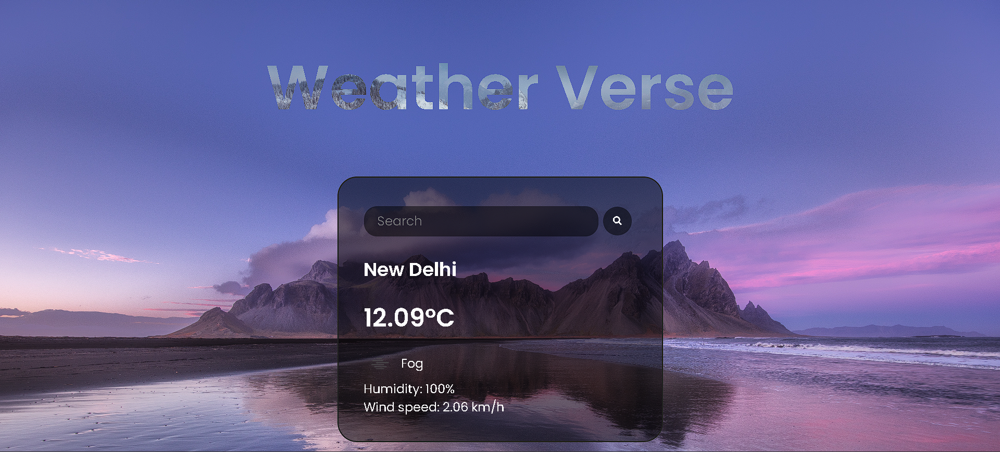

# Weather Verse  
Designed and developed a dynamic weather website utilizing HTML, CSS, and JavaScript. Implemented responsive design principles for optimal viewing across various devices. Integrated APIs to fetch real-time weather data, enabling users to access accurate forecasts based on location.

## Table of Contents

- [Description](#description)
- [Features](#features)
- [Technologies Used](#technologies-used)
- [API Used](#api-used)
- [Setup](#setup)
- [Usage](#usage)
- [Contributing](#contributing)

## Description

This is a simple weather website that allows users to check the current weather information for a specific location. It fetches weather data using an API and displays it on the web page.
https://yugalkaushik.github.io/weather-website/

## Features

- Display current weather conditions (temperature, humidity, wind speed, etc.).
- User-friendly interface for entering location details.
- Responsive design for various devices.

## Technologies Used

- HTML
- CSS
- JavaScript

## API Used

This project utilizes the OpenWeatherApp for fetching weather data.

## Setup

To run this project locally, follow these steps:

1. Clone the repository: `git clone https://github.com/yugalkaushik/weather-website.git`
2. Open the project directory in your code editor.
3. Replace `[API_KEY]` in the JavaScript file with your actual API key.
4. Open `index.html` in a web browser.

## Usage

- Enter the name of the city or location for which you want to check the weather.
- Press the "Search" or Enter button to retrieve and display the weather information for that location.

## Contributing

Contributions are welcome! If you find any issues or have suggestions for improvements, feel free to create an issue or open a pull request.

